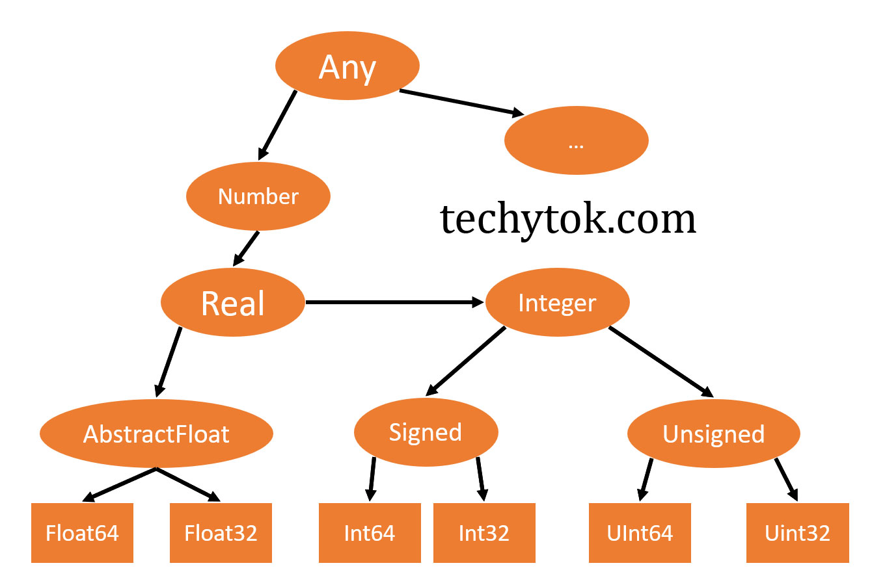

# Julia

Julia is, first of all, a nice name for a programming language.

Somehow, a lot of programming languages and tools have nice names. I guess we are a fortunate field/industry in this regard.

I digress.

Julia is a general purpose programming language, but meant to be leveraged in numerical and scientific computing scenarios. It is a bit like numerical languages like Matlab and R, except, it is actually fast! Like the old scientific language Fortran. So well, that's interesting. A fast scientific computing language.

I shall be following the following (ha) tutorials as I learn more about Julia:

- From Zero to Julia: https://techytok.com/from-zero-to-julia/
- A Deep Intro to Julia for Data Science and Scientific Computing: https://ucidatascienceinitiative.github.io/IntroToJulia/

And of course, the official Julia Manual and Documentation: https://docs.julialang.org/en/v1/

I will upload my progress [here](https://github.com/shirgho/julia-practice "Github Link")

## Variables and Types

Julia has types. Even if you don't have to declare the type of a variable (which holds an object of some type). But it has types. You can declare types, and the compiler can infer types. This is why Julia is a fast language, and not a slower dynamic language.

And the types have a hierarchical structure.

If a function works on a type, it should also work on its subtypes.

