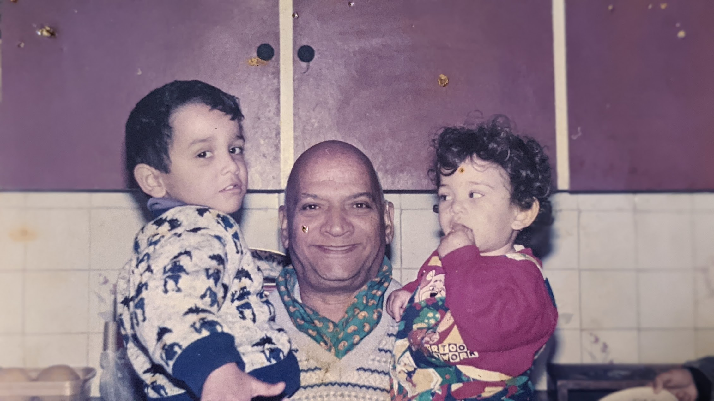

# Uncle Sultan

Was just thinking the other night, what kind of a strange and privileged experience we had growing up, because of Uncle.

And then I wondered, do people and kids nowadays have this kind of experience? Where life is not actually that serious? 

Where despite living in such a religious and conservative society, and a supposedly highly educated and civilized household, you have a bald, old, chubby, short man walking around, banging pots, saying "BC" aloud with little kids around him and then picking them up and giving them a kiss and taking them out and showing them the birds?

Where kids, who don't understand really how the world functions (no one really does), see this bald, old, chubby, short, loud, crazy man professing his love for their grandmother, for the entirety of their lives?

Everyday, saying how much he loves and hates her? How beautiful and how Zalim she was?
Saying it in front of my Grandfather, who in turn was his "blood" brother. (They cut their skin and transferred some blood, old school, haha). And then everyone rolling their eyes and continuing on with whatever they were doing.

I mean, what the hell? What the hell kind of behaviour was this? And so many other things that would have weirded so many people out. Now that I think about it, it was kinda like a mish-mash of Aangen Tera and Monty Python. But we didn't bat an eyelash, it was just completely normal nonsense. Was like the planets orbiting the sun. Day following Night.  

It was life flowing out of him. Actual life, not bullshit money, bullshit religion, bullshit culture, bullshit status, bullshit productivity. All this bullshit I see everyday, everywhere.

Not to say that he wasn't affected by all these worldly things. He liked them, but it was just an appreciation for things, not a desire or greed to have everything. He liked money too. And everyone usually gave him money when he asked for it, and he did ask for it a lot, haha. But somehow, it was like a pure asking. And he just spent the money back on us and on other people. He didn't have anything more than a bloody stupid radio and later the TV from Lahore, basically. No car. His best friend cheated him out of a house a long time ago. He didn't marry, perhaps because my family didn't approve of Tejo's daughter, who he was engaged to at some point, I think. Or maybe because he was kind of a dog, and didn't want to settle down, hahah.

Yet, he just loved everyone. He cried for hours when he heard his friend had passed away. 

Shame on me for not taking his best qualities and living them out. Shame on me for not following some simple words of advice. "Be happy all time now." Is what he used to say. It's simple, really. Well, he definitely was not happy all the time, but at least he was as he was all the time. And I think I am tending more towards this now. I am happier.

I miss him. I think my family misses him, my sister. Even though he was a pain in the ass a lot of times, a lot of times, especially his dramas and my mother having to deal with them. But he kept us all together. And his last, actual period of sickness was not nice for anyone, especially for my family. Well, he did like parts of that even. I think he believed he was Nana in those last parts of his life, haha. He said things like I'm giving all my wealth etc. to you. I was like thanks, you have like 10 rupees on you, but thanks.

He was the pillar of this extended family, even though he was "just a servant". And for this, my family deserves credit. Because despite all of the natural/societal conditioning they too must have grown up with, they let Uncle be Uncle. I think this stems from Angry Phuppo, Nana's sister, and how she looked at human beings for who they are, not what they do. But also Nana and Nani themselves, and their children, and Aliki Khala, and Wajih, and my Dad, who wasn't born into this family, but who my Uncle loved so much as well. He always asked about our family in Germany, despite only meeting them like twice in his life, I think.

And Uncle liked my friends as well, most of them, even though he would always pretend to be angry at them for coming over or taking me away. But then afterwards, he would tell me that they are all good people.

Most of the love I see in the world is selfish. It has something to do with ownership, belonging, safety, dependability, or return of investment. Love of objects. Romantic Love. Even Parental Love, for in general, parents love their children because their children belong to them. They can love them for who they are as well, but at a fundamental level, or at least initially, this love comes from something biological. But no one belonged to Uncle, and he didn't really belong to anyone, he did not reconnect with his Family in Kashmir until the last decade or so of his life. Yet, he loved everyone. Because of him, I know what actual, true, spiritual love is. I can't ask for anything more from life or God, really. So yeah, thanks God, for giving us all a taste of life through Uncle.

ps. please do a bit better and show others a piece of the good life as well. How long do you want all this suffering in the world to continue, you confusing God? If I had to make an employee performance review, you would not score well. But you're the boss, not an employee.
...
Yeah, yeah, I know, part of the bigger picture, world is a manifestation of our consciousness, probably all the floods and wars are actually my/everyone's fault, everything happens as it happens to go wherever it is supposed to go, fine, fine. Still. We need someone to blame, and I can either continue blaming everyone and myself or I can blame you.

... postscript 19.10.22

I don't/can't actually blame God. I am blaming that out which all things come from. Can only accept it, perhaps, not try to understand it, and see if it goes to somewhere better.

For all you clever athiests as well as for all you religious nutjobs, can take God to mean whatever it means or doesn't mean to you right now.

